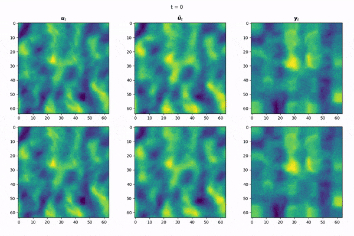
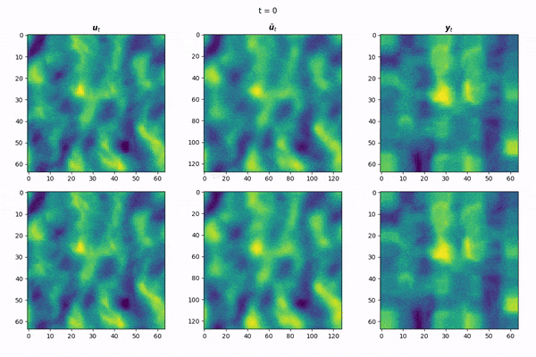

# Denoising Diffusion Operators for Data Assimilation

This is a repo for data-assimilation using denoising diffusion operators. The general idea here is tha we aim to learn the underlying stochastic process governing climate data and use that as the prior for Bayesian inference.

## Setup

To create the environment called `ddo-assimilation` run the following:

```
conda env create -f environment.yml
conda activate ddo-assimilation
```

## Datasets

We use the following sources of datasets:

1. Observational data directly from the ECMWF API ([link to notebook for examples](./notebooks/ecmwf.ipynb)).
2. NOAA observational data from Brightband (NNJA-AI) ranging from 2021 up to 2024 ([link to notebook for examples](./notebooks/nnja.ipynb)).
3. ERA-5 reanalysis data

### Visualising dataset

We can visualise the dataset as a video. For example, if we define `y` to be a 16x reduction of the original resolution then we run the following:

```
python -m scripts.generate_frames_from_dataset \
  --outdir=/tmp/dataset \
  --dataset_kwargs '{"lowres_scale_factor": 0.0625}'
cd /tmp/dataset
ffmpeg -framerate 30 -pattern_type glob -i '*.png' \
  -c:v libx264 -pix_fmt yuv420p out.mp4
```

Here is an example output (in gif format):


Here, the `y` variable is actually 8x8 px (i.e. `128*0.0625 = 8`) but has been upsampled back up to 128px with bilinear resampling.

## Running experiments

This code assumes you have a Slurm-based environment and that you are either in an interactive job or will be launching a job. If this is not the case then you can still run the below code but you must ensure that `$SLURM_JOB_ID` is defined. For instance, in a non-Slurm environment you can simply set this to be any other unique identifier.

Experiments are launched by going into `exps` and running `main.sh` with the following arguments:

```
bash main.sh <experiment name> <path to json config> <n gpus>
```

`<experiment name>` means that the experiment will be saved to `$SAVE_DIR/<experiment name>/<slurm id>`. Example json config files are in `exps/json` and you can consult the full set of supported arguments in `train.py`. `<n gpus>` specifies how many GPUs to train on.

For running experiments with `sbatch`, write a wrapper script which calls `main.sh` and specifies any required arguments.

### Generation

To generate a trajectory using a pretrained model, we can use the `generate_samples.sh` script in `exps`. This is a convenience wrapper on top of `generate.py` and it is run with the following arguments:

```
bash generate_samples.sh \
  <experiment name> \
  <n diffusion steps> \
  <n traj> \
  <output file> [<extra args>]
```

Respectively, these arguments correspond to:

- The name of the experiment, _relative_ to `$SAVE_DIR`;
- number of diffusion steps to perform (higher is better quality but takes longer);
- length of the trajectory to generate;
- and output file.

Please see `generate.py` for the full list of supported arguments, and see the next section for an example of how to generate with this script.

## Pretrained models

An example pretrained model can be downloaded [here](https://drive.google.com/file/d/1lpH6WVPqjZU1qNCH_2aWejU834mo6Urj/view?usp=drive_link). Download it to `$SAVE_DIR` and untar it via:

```
cd $SAVE_DIR && tar -xvzf test_ns_ws3_ngf64_v2.tar.gz
```

To generate a sample file from this model for 200 diffusion timesteps, cd into `exps` and run:

```
bash generate_samples.sh \
  test_ns_ws3_ngf64_v2/4148123 \
  200 \
  64 \
  samples200.pt
```

This will spit out a file called `samples200.pt` in the same directory. To generate a 30-fps video from these samples, run the following:

```
bash generate_video_from_samples.sh \
  samples200.pt \
  30 \
  samples200.pt.mp4
```

Example video (in gif format):



with the first column denoting ground truth `u_t` (it is the same across each row), middle column denoting the generated function from diffusion `\tilde{u_t}`, and the third column denoting the low-res function `y_t` (again, same for each row).

### Super-resolution

Since this model was trained with samples from `u` being 64px, we can perform 2x super-resolution by passing in `--resolution=128` like so:

```
bash generate_from_samples.sh \
  test_ns_ws3_ngf64_v2/4148123 \
  200 \
  samples200_128.pt \
  --resolution=128 --batch_size=16
```

Example video (in gif format):



## Bugs / limitations

This section details some things that should be improved or considered by whomever forks this repository.

### Generation

If you make posthoc changes to the model code (e.g. `training.networks.py`) and then want to generate samples you should also add `--reload_network`, e.g

```
bash generate.sh ... --reload_network
```

This will tell the generation script to instead instantiate the model with its network definition as defined in `networks` and then load the weights from the pickle. By default, EDM's training script pickles not just the model weights but also the network code, and this can be frustrating if one wants to make post-hoc changes to the code which are backward compatible with existing pretrained models.

### Training

Neural operators require significantly more parameters than their finite-d counterparts and this issue is also exacerbated when one is training high-res diffusion models. I suggest future works look at latent consistency models, e.g. performing function space diffusion in the latent space of a pretrained autoencoder. Otherwise, the code should be modified to support `float16` training to alleviate the memory burden.

## Credits

Thanks to my co-authors Kamyar Azzizadenesheli, Nikola Kovachki, Jean Kossaifi, Boris Bonev, and Anima Anandkumar. Special thanks to Tero Karras, Morteza Mardani, Noah Brenowitz, and Miika Aittala.
